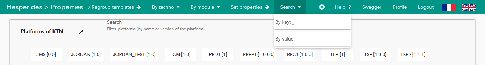
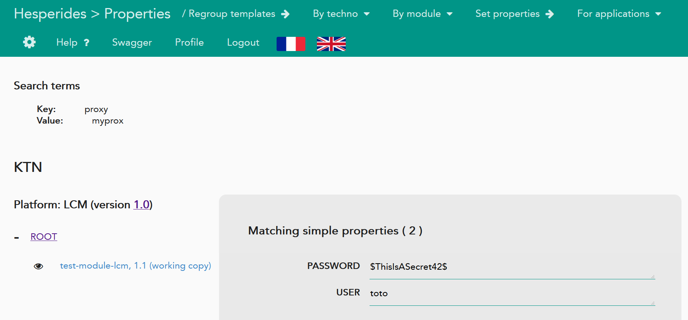

# Recherches de propriétés

Nous souhaitons ajouter à l'interface web d'Hesperides une fonctionnalité de recherche de propriétés,
par nom et par valeur.

<!-- Pour mettre à jour ce sommaire: 
    markdown-toc --indent "    " -i properties_search.md.md
-->

<!-- toc -->

- [Besoin fonctionnel](#besoin-fonctionnel)
- [Design](#design)
- [Mockups](#mockups)
    * [navbar](#navbar)
    * [search results](#search-results)

<!-- tocstop -->

## Besoin fonctionnel

- mettre à disposition côté _frontend_ la fonctionnalité de recherche de propriétés du _backend_ : [hesperides #384](https://github.com/voyages-sncf-technologies/hesperides/issues/384). LADR backend: [Recherche de propriétés](https://github.com/voyages-sncf-technologies/hesperides/blob/master/documentation/lightweight-architecture-decision-records/search_properties.md)

## Design

- on ajoute à la _navbar_ horizontale un bouton qui redirige vers la page de recherche
- on ajoute un nouveau _path_ `/search-properties`, qui affiche :
    * les termes de recherche employés
    * une liste de propriétés qui ont le nom et/ou la valeur recherchés, groupées par `$APP-$PTF`, avec pour chacune les informations suivantes :
        + le type de propriété : globale / de module / d'instance
        + le nom, la valeur et les annotations de la propriétés
        + indiquer s'il s'agit d'une propriété supprimée
        + un hyperlien vers le module déployé correspondant (ou l'instance / plateforme le cas échéant)

## Mockups

### navbar

### search results

